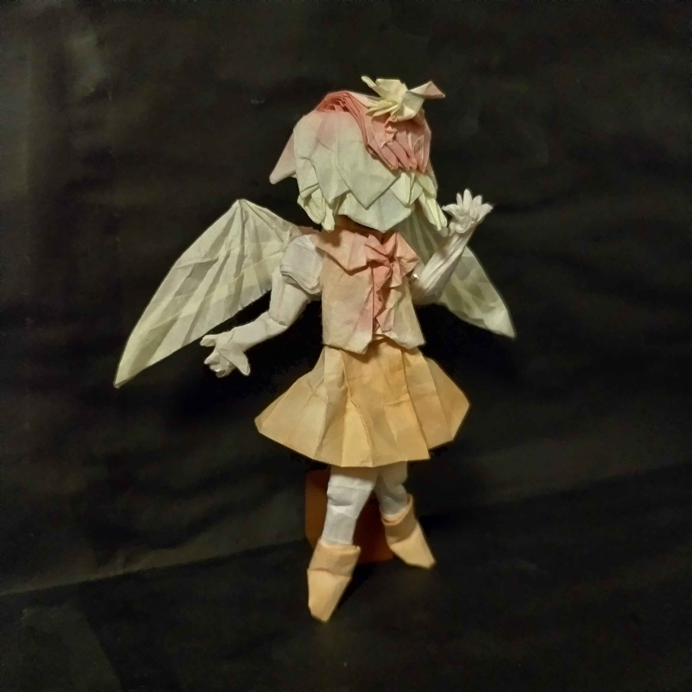
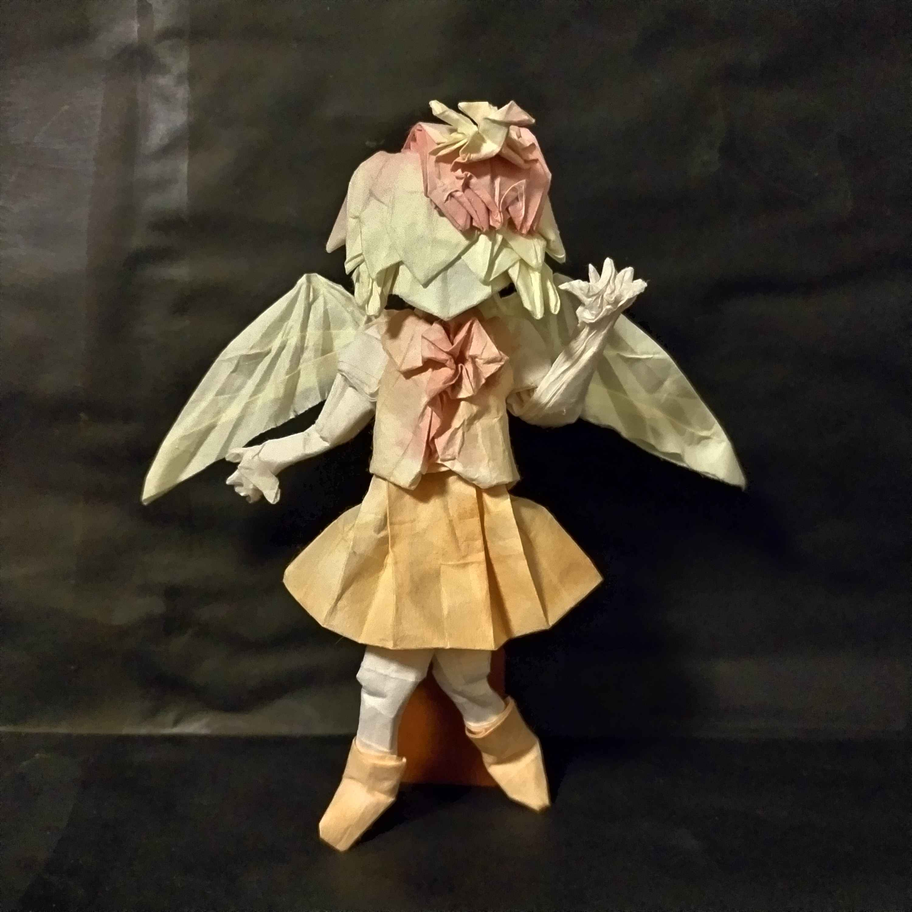

<!DOCTYPE html>
<html lang="ja">
<head>
    <meta charset="UTF-8">
    <meta name="viewport" content="width=device-width, initial-scale=1.0">
    <title>Origami Archive</title>
    
</head>
<body>

    <h1>澤島の折紙の作品</h1>

    <!-- 💡 ここから作品1つ分のブロック（新しい順に上に書き足していく） -->
    

        <h2>02. 新しい作品名</h2>
        <ul class="meta">
            <li><strong>日付:</strong> 2026年6月1日</li>
            <li><strong>仕様:</strong> 50x50 grid / カラペラピス</li>
        </ul>
        

            <strong>備忘録・反省点:</strong> 
            背中の沈め折りが厚みで破けそうになった。次は120度きっちり折り目をつけてから沈めること。
        

        
    

    
    

        <h2>01. 庭渡久侘歌（東方鬼形獣３面）</h2>
        <ul class="meta">
            <li><strong>日付:</strong> 2026年5月24日</li>
            <li><strong>仕様:</strong> 48x48 grid / 障子紙　470mm四方正方形　一枚</li>
        </ul>
        

            <strong>備忘録・反省点:</strong> 
            ここに折り紙の作品を残しておく
            一つ目の作品は東方のキャラ庭渡久侘歌
            障子紙にノリを塗って折っている。ポイントは頭部のひよこで上手く髪の毛と合わせるために多くの領域を使用しているので
            若干頭が大きい。翼の良い折り方を思いついたらもう一度作り直す。
        

        <!-- 写真のファイル名を指定 -->
        
    

    

        <h2>01. 作品名</h2>
        
<a href="project01.html" style="color: #deff9a;">→ 制作過程と詳細メモを見る</a>

        
        <ul class="meta">
            <li><strong>日付:</strong> 2026年5月24日</li>
        </ul>
    <!-- 💡 ブロックここまで -->

</body>
</html>
